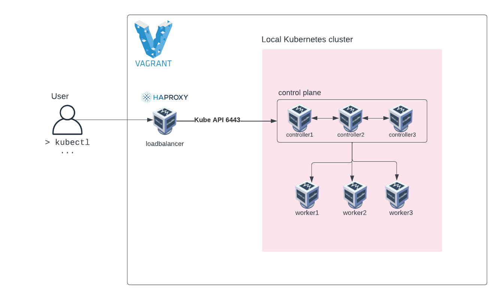

# Kubernetes the Kubeadm way

> Hard way 2 hard 4 me

This project contains some automation to boot up Kubernetes cluster using Ansible and Vagrant VirtualBox provider. 

There's also Terraform to allow provisioning the infrastructure in Google Cloud, however still WIP.

TODO: 

- Cilium

## Requirements 

- VirtualBox
- Vagrant 
- Ansible
- SSH key pair located in project root

## Usage

You can use any virtual machines you want. This project uses Vagrant to automate VirtualBox VM installation.
As long as Ansible inventory is populated any VM should work.

Start virtual machines with Vagrant
```shell
cd vagrant
vagrant up
```

Bootstrap Kubernetes cluster
```shell
ansible-playbook -i ansible/inventory.ini  ansible/main.yml
```

After playbook has finished running, `kubeconfig` can be found in Ansible directory.
```shell
kubectl get nodes --kubeconfig admin.conf
NAME          STATUS   ROLES           AGE     VERSION
controller1   Ready    control-plane   2m26s   v1.26.3
controller2   Ready    control-plane   86s     v1.26.3
controller3   Ready    control-plane   24s     v1.26.3
```

To destroy everything, run
```shell
cd vagrant
vagrant destroy -f
```

## HAproxy

Load balancing ports 6443 (Kube API) and 2379 (etcd)

See health check status page http://192.168.56.120:9000/

## Architecture


